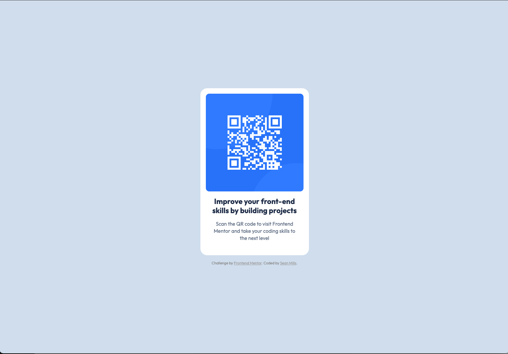

# Frontend Mentor - QR Code component solution

This is a solution to the [QR code component challenge on Frontend Mentor](https://www.frontendmentor.io/challenges/qr-code-component-iux_sIO_H). Frontend Mentor challenges help you improve your coding skills by building realistic projects.

### Screenshot

### Links

- Live Site URL: [Add live site URL here](https://smills1020.github.io/frontend-mentor-qr-code/)

### Built with

- Semantic HTML5 markup
- CSS custom properties
- Flexbox
